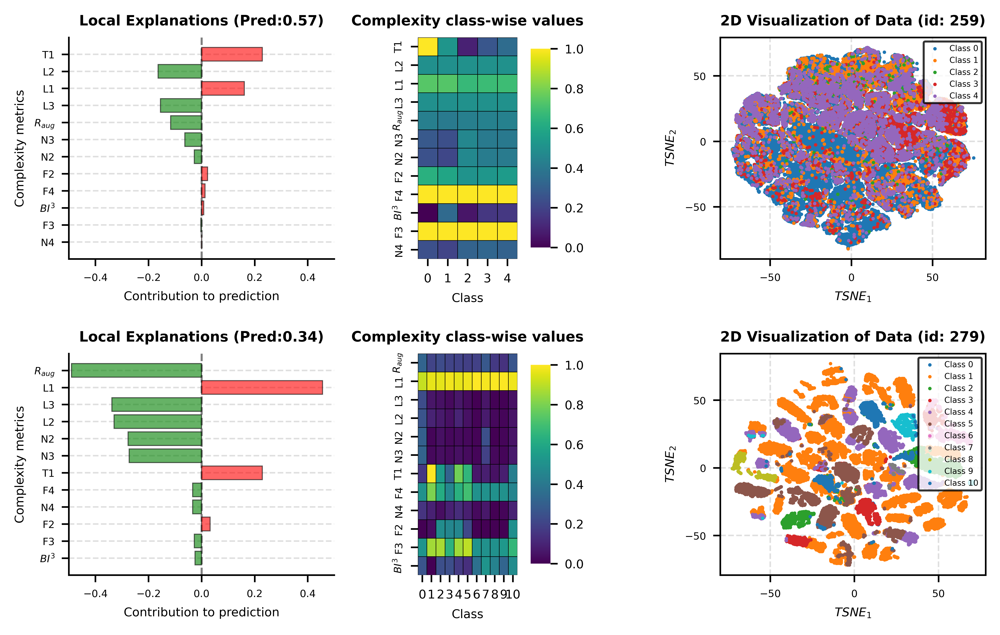

# Imbalanced_Dataset_Characterization



# GAMformer Analysis: Meta-Modeling for Dataset Complexity and Class Difficulty Prediction

[](https://opensource.org/licenses/MIT)
[](https://www.python.org/downloads/)

## Overview

This repository provides an implementation the first end-to-end explainable framework for imbalanced data that forecasts a dataset’s classification di!culty while simultaneously identifying and quantifying the key data irregularities dictating such assessment. Data irregularities refers to factors such as class overlap, noise, small disjuncts, complex class structure, non-linear decision boundaries or any other factor that limits classifier performance. This repository contains the code utilized for the submitted paper to a scientific journal.

The core implementation is contained in `domain_analysis.py`, which encapsulates the entire workflow in a single class for ease of use. `model_performance_Multiclass_analysis.py` contains the meta-model testing procedure and makes corresponding latex tables. `meta_dataset_extraction.py`contains the code for extracting the meta-feature required for utilizing the framework with custom datasets. 

## ABSTRACT

Despite extensive work on imbalanced classification, the reasons why certain datasets prove more challenging than others remain poorly understood, owing to the intricate interplay of class imbalance with data irregularities such as class overlap, the presence of small disjuncts or noise. We address this gap by introducing the first end-to-end explainable framework that forecasts a dataset’s classification difficulty while simultaneously identifying and quantifying the key data irregularities dictating such assessment. Our contributions are threefold: (1) a suite of GPU-accelerated complexity metrics tailored for imbalanced domains, which act as meta-feature in the proposed framework; (2) two novel, scalable methodologies for computing complexity measures in multiclass settings; and (3) two explainable profiling models, one based on Explainable Boosting Machines (EBMs) and another on GAMformer, a state-of-the-art additive in-context learning model. On a benchmark of approximately 600 real-world binary and 120 multiclass datasets, our EBMs and GAMformer achieved a $R^2$ of 0.887 and 0.888 for binary classification problems and 0.934 and 0.902 for multiclass settings, respectively, while producing transparent explanations that align with both theoretical expectations and t-SNE visualizations. Finally, we showcase real-world applicability by accurately identifying when SMOTE and cost-sensitive Random Forests, two widely adopted technique for addressing imbalanced domains, will improve classification outcomes across varying data profiles. The proposed framework is computationally efficient (GAMformer requires no training), highly accurate, and readily interpretable, offering a powerful tool for dataset profiling, benchmarking, method development, and meta-learning in imbalanced classification.


**Key Contributions:**
- A suite of GPU-accelerated complexity metrics tailored for imbalanced domains, which act as meta-feature in the proposed framework;.
- Two novel, scalable methodologies for computing complexity measures in multiclass settings;
- Two explainable profiling models, one based on Explainable Boosting Machines (EBMs) and another on GAMformer, a state-of-the-art additive in-context learning model. 


## Installation

1. **Install RAPIDS (cuML and CuPy):**  
   RAPIDS is recommended via conda for ease and compatibility. Use the [RAPIDS Release Selector](https://rapids.ai/start.html) to generate commands. Example for CUDA 12.0, Python 3.10:

   ```bash
   conda create -n gamformer python=3.10
   conda activate gamformer
   conda install -c rapidsai -c conda-forge -c nvidia rapids=24.08 cuda-version=12.0
   ```

   - For pip (less recommended, requires matching CUDA toolkit):  
     ```bash
     pip install --extra-index-url=https://pypi.nvidia.com cuml-cu12==24.08.*
     ```
     Ensure CUDA toolkit 12.x is installed.

2. **Install Remaining Dependencies** 

    Then, install ticl as outlined in https://github.com/microsoft/ticl. Lastly, install remaining dependencies via:

    ```bash
    pip install --upgrade pip
    pip install -r requirements.txt
    ```

## Usage

### Quick Start

1. **Initialize the Analysis Object:**

   Load meta-datasets and train the GAMformer meta-model:

   ```python
   from gamformer_analysis import GAMformerAnalysis

   analysis = GAMformerAnalysis(
       complexity_file="path/to/complexity.npy",
       cd_file="path/to/CD.npy",
       model_str="your_model_checkpoint.cpkt",
       aggregate_func=np.mean,  # Optional: aggregation for complexity arrays
       device="cuda" if torch.cuda.is_available() else "cpu"  # Optional
   )
   ```

   This step automatically loads the meta-features, targets, and fits the model.


   ```
2. **Plot and Analyze:**

   Generate a multi-panel figure for visualization and save to disk:

   ```python
   cd_pred = analysis.plot_and_analyze((X, y, dataset_id), save_fig=True, output_dir="output_plots")
   ```

   The figure includes:
   - Local explanation (bar plot of metric contributions).
   - Class-wise complexity heatmap (multiclass only).
   - 2D visualization of the dataset (t-SNE if >2 features).

   Additionally, the estimated classification difficulty (cd_pred) is generated.

### Example Script

See the `__main__` block in `gamformer_analysis.py` for a complete example using synthetic datasets from scikit-learn:

```python
if __name__ == "__main__":
    # Binary example
    analysis_binary = GAMformerAnalysis(...)
    X, y = make_blobs(...)  # Synthetic data
    analysis_binary.plot_and_analyze((X, y, 1), save_fig=True, output_dir="output_plots_synthetic")

    # Multiclass example
    analysis_multiclass = GAMformerAnalysis(...)
    X, y = make_blobs(n_classes=5, ...)
    cd_pred = analysis_multiclass.plot_and_analyze((X, y, 2), save_fig=True, output_dir="output_plots_synthetic")
```

This produces PNG files like `analysis_dataset_1.png` with interpretable plots.

## Methodology

### Complexity Metrics

The framework computes 12 metrics capturing aspects of feature overlap, linearity, neighborhood structure, and imbalance:

- **F2, F3, F4**: Fisher discriminant ratios and volume overlaps.
- **L1, L2, L3**: Linear separability measures.
- **N2, N3, N4**: Neighborhood and density-based metrics.
- **R_aug**: Augmented ratio for imbalance.
- **T1**: Hypersphere-based topology.
- **BI^3**: Bayes imbalance ratio.

For multiclass, metrics are decomposed using one-vs-all (OvA) strategy.

### Meta-Modeling with GAMformer

- **Meta-Dataset**: Precomputed complexity features (`complexity.npy`) and class difficulties (`CD.npy`) attained from 700 OpenML datasets.
- **Model**: GAMformerRegressor from `ticl`, a transformer-based GAM for regression, providing additive interpretability.
- **Prediction**: Outputs include predicted CD (`y_pred`), per-metric contributions (`components`), and sorted rankings.

### Visualization

- **Local Explanations**: Horizontal bar plot showing positive/negative contributions to CD prediction.
- **Heatmap**: Class-wise metric values (multiclass).
- **2D Projection**: t-SNE for high-dim data, with class scatters.

This design emphasizes interpretability, aligning with XAI principles in ML research.

## Evaluation and Reproducibility

For reproducibility, use fixed random seeds (e.g., `random_state=42` in examples). Synthetic datasets allow controlled testing of complexity variations. In empirical studies, compare predicted CD against actual model performance (e.g., error rates) on benchmarks like OpenML.

## Limitations

- Requires precomputed meta-datasets and a valid GAMformer checkpoint.
- GPU acceleration recommended for large datasets.
- Assumes access to `src` module for metric functions; adapt as needed.

## Citation

WIP

## License

This project is licensed under the MIT License. 


